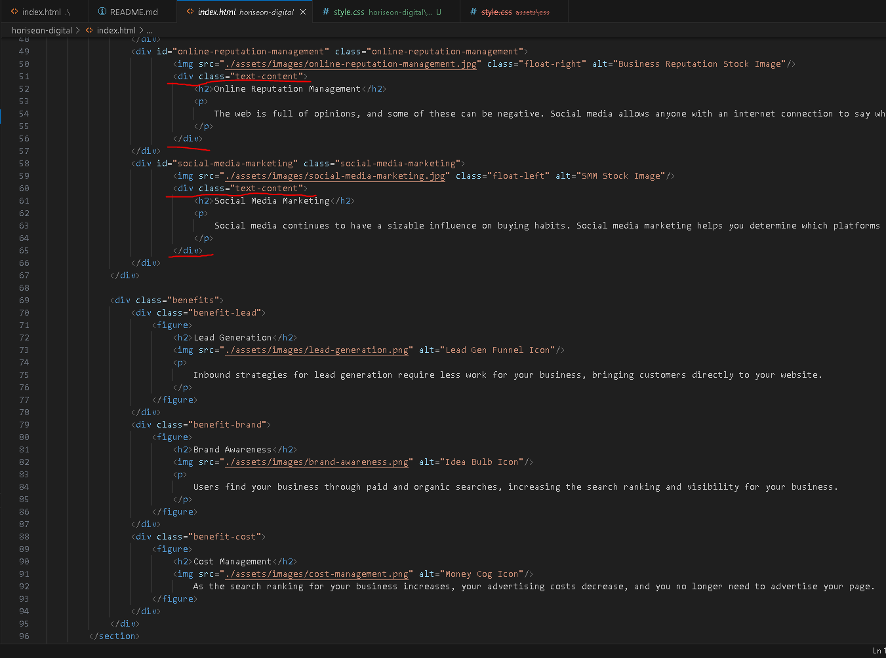

# Horiseon-Digital
## Codebase for accessibility-optimized marketing agency website

## Description
The purpose of this project was to help Horiseon Social Solutions, a digital marketing agency, improve their SEO by optimizing not only their HTML and CSS structure but also the overall accessibility of their website. Though accessbility isn't a direct ranking factor for SEO performance, by enhancing the HTML for semantic architecture, a positive effect will be achieved as search engines better interpret and understand the context and relevance of their content. Furthermore, adjustments in CSS were applied to center-align text across several areas in the code for better readability and overall user experience, both of which factors contribute to improved SEO.

## Learnings/takeaways
Though center-aligning isn't that notable a takeaway, some key learnings can be drawn from attempting to position the headings and paragraph elements correctly within the website's cards. Instead of enclosing the cards' header and paragraph tags in figure tags with class selectors, div tags proved more effective when it came to manipulating the positioning of text and corresponding headings. 

        
## Installation
N/A

## Usage 
Navigate across and better understand the services that Horiseon Social Solutions offer by clicking on the corresponding service using the navigation bar at the top of the webpage.

## License
N/A
